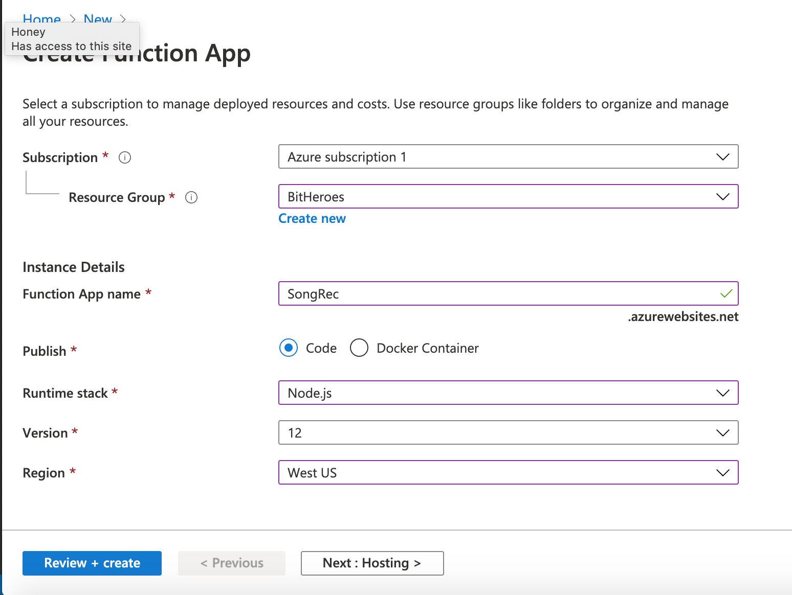

### [Better Song Recommendations #1] Using the Microsoft Face API and Azure Functions to get \*emotional\* 

Ever looked at your face and wondered how you were feeling? No? Neither have I, but lucky for the both of us, the Microsoft Face API can do exactly this. In this series, I’ll be outlining the process of building an app that recommends songs based on a picture(tagline: Upload a selfie. We choose the songs). The user will login to Spotify, upload a picture of themselves, and receive a customized playlist that (hopefully) matches their current mood. Here's a basic flowchart of our final project:


In Part 1, we’ll be focusing on the centerpiece: deciphering the user’s face.

We'll be using Azure Functions in this project. If you're unfamiliar, Azure Functions allows you to write and deploy serverless code without having to manage infrastructure. It incorporates a variety of triggers that allows your function to run on-demand in response to a variety of events. Here are a couple common triggers:

- HTTP Trigger(today's star <3)
- Timers Trigger(runs on a timed bases: daily, weekly, etc)
- Blob Trigger(when a file is added to Azure Blob storage)
- Cosmos DB Trigger(when data is added to Azure Cosmos DB)
- Storage queue Trigger(when a message is submitted to the storage queue)

To familiarze yourself with the different types, I'd recommend trying out [this](https://docs.microsoft.com/en-us/learn/modules/execute-azure-function-with-triggers/) Microsoft module, which runs you through some basic examples.


### Creating a Face API Subscription

We'll be using the Microsoft API to extract data on a person's emotions from a picture. The Face API is a cognitive service that provides algorithmns for identifying/detecting faces and analyzing attributes of faces in images. For more information, check out the API documentation and tutorials [here](https://docs.microsoft.com/en-us/azure/cognitive-services/face/). First step is to get an actual Face API endpoint. This can be done easily in the Azure Portal: Go to **Create a Resource**, press the **AI + Machine Learning** tab on the left, and select **Face**.


Deploy your resource, and save your endpoint!


### Creating an Azure Function

It's time to create our Azure Function- I'm just using the Azure Portal, but those who prefer Visual Studio Code can refer [here.](https://docs.microsoft.com/en-us/azure/azure-functions/functions-create-first-function-vs-code?pivots=programming-language-javascript) In the portal, select **Create a Resource **and then press **Function App**. Select a Resource Group(mine uses the same one as the Face API resource) and give the app a unique name. For runtime stack, select Node.js and Version 12. For region, choose one near you.



Go to **Hosting**.

Select or create a new storage account to be linked to this function app. Select your operating system and the consumption plan. 


Go to **Monitoring**.

Enable Application Insights. 


**Review + create** your app! Once it's deployed, return to the Portal homepage and click into your newly deployed Function App. In the app service, click the **Functions** in the left tab(has the little fx symbol).


Now that our Function App exists, we can create an actual function. 


Your functions page should look something like this, but empty. To create a function, click the **+Add** button and select HTTP trigger. Set your authorization level as function- this means that the caller needs to provide a key.


Wait for the function to deploy, then click into the **Code + Test** tab and go to your index.js file.

Replace the code with this: 

This code is triggered by an HTTP request and parses HTML multipart data(our image!) with the help of the extremely helpful [parse-multipart](https://www.npmjs.com/package/parse-multipart) library. We're then calling the Face API in the function **analyzeImage** using the subscription key and endpoint from earlier, passing in our parsed image. This uses the [request-promise](https://www.npmjs.com/package/request-promise) library, which is basically request but with Promise support, which we require in our async **analyzeImage** function. Using `JSON.parse()`, we return the body in a JSON format. 

```js
var multipart = require("parse-multipart");
var request = require('request-promise');
var util = require('util');
 
module.exports = async function (context, req) {
    context.log('JavaScript HTTP trigger function processed a request.'); 
    // encode body to base64 string
    var bodyBuffer = Buffer.from(req.body);
    
    var boundary = multipart.getBoundary(req.headers['content-type']);
    // parse the body with parse-multipart
    var parts = multipart.Parse(bodyBuffer, boundary);
    
  	//calls a function that calls the Face API
    var result = await analyzeImage(parts[0].data);

  	//stick the data returned into our http response!
    context.res = {
        body: {
            result
        }
    };
    console.log(result); 
    context.done();  
};
 
async function analyzeImage(byteArray){
    
    const subscriptionKey = 'YOUR KEY';
    const uriBase = 'YOUR ENDPOINT' + '/face/v1.0/detect';

  //Face API params
    const params = {
        'returnFaceId': 'true',
        'returnFaceAttributes': 'emotion'
    };

    const options = {
        uri: uriBase,
        qs: params,
        body: byteArray,
        headers: {
            'Content-Type': "application/octet-stream",
            "Ocp-Apim-Subscription-Key": subscriptionKey
        }
    }
    let jsonResponse;
    
    await request.post(options, (error, response, body) => {
        if (error){
            console.log('Error: ' + error);
            return;
        }

        jsonResponse = JSON.parse(body);   
    });
    return jsonResponse;
    
}
```

Here's an example of the JSON response returned for this image:


```json
{
  "result": [
    {
      "faceId": "89afb8d2-500f-4f02-8863-8278fe5f47a2",
      "faceRectangle": {
        "top": 268,
        "left": 338,
        "width": 270,
        "height": 270
      },
      "faceAttributes": {
        "emotion": {
          "anger": 0,
          "contempt": 0,
          "disgust": 0,
          "fear": 0,
          "happiness": 1,
          "neutral": 0,
          "sadness": 0,
          "surprise": 0
        }
      }
    }
  ]
}
```
Apparently I'm 100% happy. yay.


### Creating a Test HTML Webpage

Yay! We pretty much have everything we need to detect emotion in a face! We're going to test this out with a simple HTML webpage, though the actual frontend of our project will be a React App that we make later. 


Here's the sample HTML webage with a HTML form(ft absolutely nonexistent styling)...

```html
<!DOCTYPE html>
<html lang="en">
  <head>
    <meta charset="utf-8">
    <meta http-equiv="X-UA-Compatible" content="IE=edge">
    <meta name="viewport" content="width=device-width, initial-scale=1">
    <meta name="description" content="">
    <meta name="author" content="">

    <title>Azure App Service - Sample Static HTML Site</title>

  </head>

  <body>
    
    <div class="navbar-wrapper">
      <div class="container">
          <h1>Test your Function!</h1>
          <hr/>
      </div>
    </div>

    <!-- Wrap the rest of the page in another container to center all the content. -->

    <div class="container">
      <script>
      var loadFile = function(event) {
        var image = document.getElementById('output');
        image.src = URL.createObjectURL(event.target.files[0]);
      };
      </script>
      <form id="myform" onsubmit="event.preventDefault(); handle(event);" enctype="multipart/form-data">
        <div class="form-group">
          <label for="file"> Upload a Face Image File:</label>
          <!--<input type="file" name="file" id="file" class="form-control-file" /> -->
          <input type="file"  accept="image/*" name="image" id="file" onchange="loadFile(event)"/>
          </p>
        </div>
        
        <button type="submit" class="btn btn-secondary btn-sm">Submit</button> 
        <button class="btn btn-secondary btn-sm" id="clear" onclick="event.preventDefault();clearForm()">Clear</button>
      </form>

      <hr/>

      <div id="emotion"></div>

    </div>

    <!-- Bootstrap core JavaScript
    ================================================== -->
    <!-- Placed at the end of the document so the pages load faster -->
    <script src="https://ajax.googleapis.com/ajax/libs/jquery/1.11.3/jquery.min.js"></script>
    <script>window.jQuery || document.write('<script src="../../assets/js/vendor/jquery.min.js"><\/script>')</script>
    <!-- <script src="js/bootstrap.min.js"></script> -->
    <script src="app.js" type="text/javascript"></script>
  </body>
</html>


```

and the corresponding js file(called app.js).
Inside the app.js file, the `handle(event)`function is called upon form submission, and makes an http post call to your Azure Function with the submitted image in the body. Make sure you replace the url with your own Function url, and the key with your Function key.


```js

function handle(event){

    event.stopPropagation();
    event.preventDefault();
    console.log('---- handle ---');

    var myform = document.getElementById('myform');

    console.log('---- myform ---'+myform);
    var payload = new FormData(myform);
    console.log('---- handle completed---');

    $.ajax({
        type: "POST",
        url: "YOUR FUNCTION URL HERE",
        crossDomain: true,
        data: payload,
        contentType: false,
        processData: false,
        headers: {'x-functions-key': 'YOUR FUNCTION KEY'},

        success: function (resp) {
            console.log(resp);
            var data = JSON.parse(resp);
            console.log(data.result);

            data = data.result[0];
            console.log(data);
            var emotion = data.faceAttributes.emotion;

            var resultString = `

            <h3>Emotions in the image:</h3><br />
            <p>anger: ${emotion.anger}</p>
            <p>contempt: ${emotion.contempt}</p>
            <p>disgust: ${emotion.disgust}</p>
            <p>fear: ${emotion.fear}</p>
            <p>happiness: ${emotion.happiness}</p>
            <p>neutral: ${emotion.neutral}</p>
            <p>sadness: ${emotion.sadness}</p>
            <p>surprise: ${emotion.surprise}</p>
            `;
            
            $('#emotion').html(resultString);
        },

        error: function (err) {
            console.log('---ERROR: '+err);
        }
    });
}

function clearForm(){
    document.getElementById('myform').reset();
    document.getElementById('emotion').innerHTML = '';

}


```

 You can deploy this html page however you like- I'm just doing it with the **live server extension** in Visual Studio Code like so:


The final step for this test to work is to allow this HTML page to interact with your function through CORS. CORS, aka Cross-origin resource sharing, allows whatever domains our web application will be hosted on to access resources from another domain(in this case, we need access to our Azure Function). Go to your App Service resource(not the individual function) and click the CORS tab on the left side. Add your http: url to the allowed origins(this works with local hosts and live servers).


Run your HTML page, upload a file, and have fun seeing the results!


Check out the range in her face!! 
